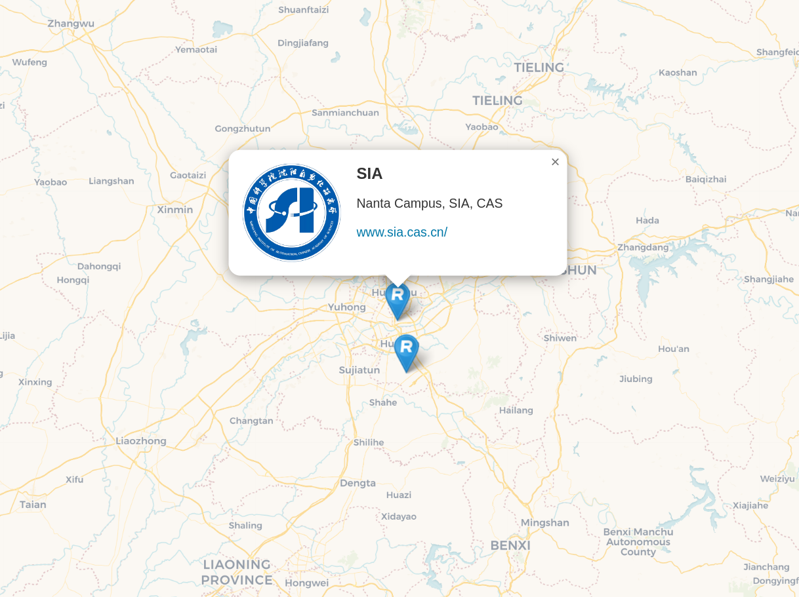

<!--
 * @Author: likecanyon 1174578375@qq.com
 * @Date: 2025-05-08 09:31:51
 * @LastEditors: likecanyon 1174578375@qq.com
 * @LastEditTime: 2025-05-08 09:37:25
 * @FilePath: \AlumniMap\README.md
 * @Description: 这是默认设置,请设置`customMade`, 打开koroFileHeader查看配置 进行设置: https://github.com/OBKoro1/koro1FileHeader/wiki/%E9%85%8D%E7%BD%AE
-->
# SIA,CAS Alumni Community World Map

- This map features alumni from SIA, CAS who are open to sharing their experiences and connecting with fellow alumni.
- It’s hosted on GitHub, making it easy for anyone to contribute and add their own location. ♥️ Come join us!

👉 __https://sia-share.github.io/AlumniMap/__

The screenshot above shows what user entries look like. You’ll even get your own URL for your entry, which is awesome! Look, this is a [link to SIA,Nanta](https://sia-share.github.io/AlumniMap/#siananta).

## How to add and manage your entry?

- You can add your marker to the map and manage your data by yourself.
- Learn about [3 ways how to manage your entry](https://github.com/sia-share/AlumniMap/tree/master/_directory)! 🚀
- You may use this [link](https://www.latlong.net/) to find your own latitude and longitude.

## Who’s the map for?

The map is for any SIA student, staff, alumnus and alumna. The SIA alumni include all individuals who have ever studied or worked at SIA. It’s about visualizing the distribution of the SIA alumni community. If you one of SIA, the map is for you!

## How does this map work?

No big deal: GitHub allows to generate static websites out of repositories. They make use of [Jekyll](https://jekyllrb.com), a ruby based generator. Jekyll comes with [Liquid](https://shopify.github.io/liquid/) templates, which helped us to inject all our map entries within a JSON at the bottom of the HTML. JavaScript grabs the data and starts a nice [Leaflet](http://leafletjs.com) map with beautiful tiles provided by [CARTO](https://carto.com/location-data-services/basemaps/).  
— Well, that’s it. ¯\\\_(ツ)_/¯

## Can we use your map for our community?

Sure, it’s open source! However, we don’t provide a release or some setup script. We’d recommend you to download the repo as zip file instead and make it run on your local machine first (see [SETUP.md](https://github.com/sia-share/alumnimap/blob/master/SETUP.md) for instructions). Afterwards you’ll need to replace some ` SIA ` content with your community content, empty the `_directory/data` folder and start over with a shiny fresh map.

## How to run the map on my local machine?

See [SETUP.md](https://github.com/sia-share/alumnimap/blob/master/SETUP.md) for instructions.

## 🛠️ Maintainers

  

